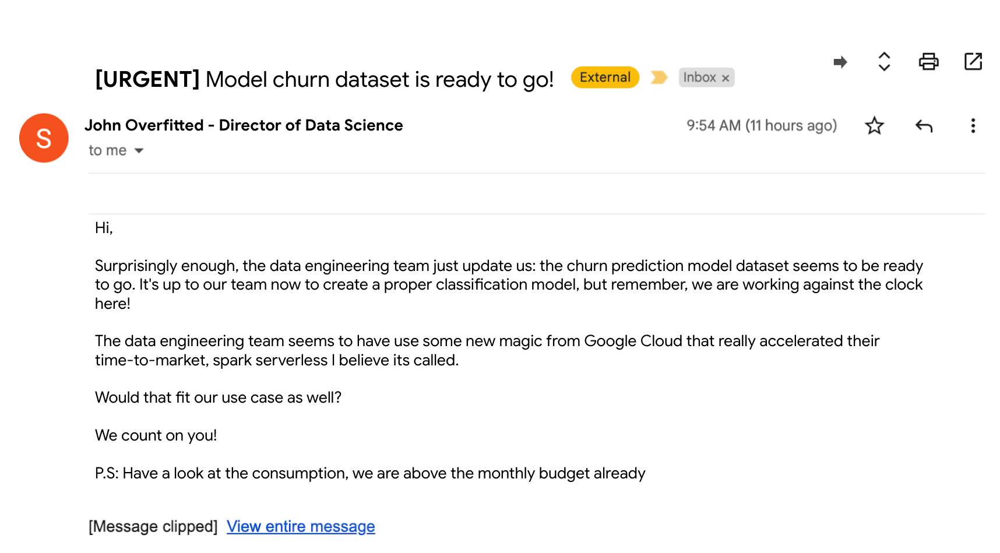
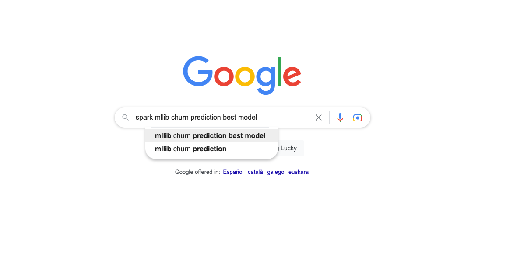
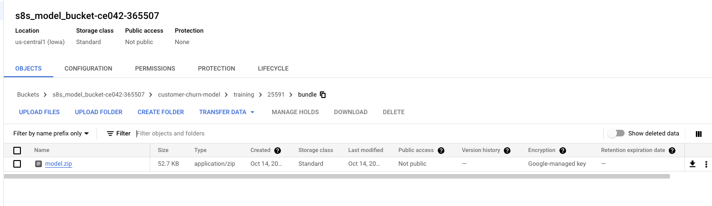

# Lab 2 - SPARK Hackfest - Machine Learning with SPARK

## CE042
![[/fragments/labmanuallogo]]

## Overview

Welcome to the **SPARK Hackfest!** <br><br>In this lab you will take on the role of a data scientist. You will be challenged to workable machine learning using SPARK MLib. Your input data will be the dataset generated on the previous Lab (Lab 1 - SPARK Hackfest - Data Ebgineering with SPARK). You will ierating on a Jupyter notebook.
Then, you will refactor the code into a a single pyton script, to serialize the model generation into a MLeap object, and will launch the job using the batch interface of SPARK Serverless.


## Learning objectives

The lab includes studying and developing a number of common data science tasks, including: <br>
* Interactive model generation using a BigQuery dataset as input, you will use Spark Serverless (MLib) from a managed Google Vertex managed notebook<br>
* Development of feature engineering pipeline  using Spark Mlib <br>
* Development of a model training pipeline  using Spark Mlib <br>
* Development of a python script to operativize the training, serializing the model into MLeap format, the code will by execute by Spark in batch mode <br>

**_NOTE:_** The code provided in this lab is templatized, you will need to fill the code blocks marked with `INSERT_CODE_HERE` keyword.

For example:

* Use `randomSplit` to split the data into the `trainDF`, `testDF` dataframes

```python
SPLIT_SEED = 6
SPLIT_SPECS = [0.8, 0.2]
print('....Splitting the dataset')
trainDF, testDF = inputDF._______INSERT_CODE_HERE_______
```
Code generated

```python
#INSERT CODE
SPLIT_SEED = 6
SPLIT_SPECS = [0.8, 0.2]
print('....Splitting the dataset')
trainDF, testDF = inputDF.randomSplit(SPLIT_SPECS, seed=SPLIT_SEED)
```

## Setup and Requirements

![[/fragments/startqwiklab]]

![[/fragments/gcpconsole]]

![[/fragments/cloudshell]]

## Laboratory execution

### Introduction

It all starts when, on a quiet Tuesday morning, you receive the following email:



It seems a quite urgent task, so lets get to work! <br><br>  
First thing first:



After some "stackoverflow/medium engineering", we decide to go for a Random Forest Classifier.
It seems we can generate this model with Spark MLib, lets get to it.
But which environment can I use for experimenting and generating the model?


 [Dataproc serverless]( https://cloud.google.com/dataproc-serverless/docs) lets you run Spark interactive workloads without requiring you to provision and manage your own cluster. You just need to connect to a Vertex AI Jupyter Notebook and start using a PySpark session without the need to create or manage a cluster.

 Using Dataproc serverless is very well suited for your task asignement:

 * Accelerated time-to-market: Spark developers and data scientists can use notebooks for their development, data exploration, and machine learning use cases without having to set up clusters in advance.
* No ops: The Data team does not need to create and manage clusters for individual users.
* Cost effective: Serverless Spark sessions auto-scale as needed vs fixed size clusters created for individual users. The sessions are also not under-utilized like larger long-running clusters used for interactive development.

## Lab deployed objects

In your Google Cloud project, you will find the following list of elements already pre-provisioned:

* A Service Account (`s8s-lab-sa@<PROJECT_ID>.iam.gserviceaccount.com`) + roles required for lab execution
* A VPC (`s8s-vpc-<PROJECT_ID>`) + subhet (spark-snet) + firewall rules
* GCS bucket for data (`gs://s8s_data_bucket-<PROJECT_ID>`)
* GCS bucket for code (`gs://s8s_code_bucket-<PROJECT_ID>`)
* GCS bucket for model serialization (`gs://s8s_model_bucket-<PROJECT_ID>`)
* A Google managed notebook (`s8s-spark-ml-interactive-nb-server`) with a predefined notebook
* Persistent History Server (dataproc) (`s8s-sphs-<PROJECT_ID>`)
* A BigQuery dataset (`customer_churn_ds`)
* A BigQuery table with the lab01-data-engineering output (`training_data_step_3`)
* A Container image for SPARK (`gcr.io/<PROJECT_ID>/customer_churn_image`)
* A Dataproc metastore (`s8s-dpms-<PROJECT_ID>`)

### Model development with dataproc serverless

1. From your Google Project, navigate to Vertex AI Managed notebooks and click on `OPEN JUPYTERLAB`

Follow this sequence:


Paste the value:

`spark.jars.packages=com.google.cloud.spark:spark-bigquery-with-dependencies_2.12:0.25.2`

2. You will see a pre-created notebook called `lab02-model_training.ipnby`, open it with the newly created Spark Serverless kernel
3. Complete the notebooks cells where input code is required


### Operativize the training job with Spark batches

At this point, you have successfully train a ML model, the next step will be to operationalize the training by refactoring the notebook code into a regular python script

1. From your Google Project, Open Cloud Shell
2. Execute 

```bash
$> export PROJECT_ID=`gcloud config list --format "value(core.project)" 2>/dev/null`
$> gcloud storage cp gs://s8s_code_bucket-${PROJECT_ID}/setup_model_files.sh .
$> ./setup_model_files.sh
```
This will download files for model building operativization

```
datascience
├── model_building.py
├── launch_model_building.py
└── upload_model_building.py
```

3. Complete the code blocks on the  `model_building.py` file

4. Once the file is ready, you need to upload the py script to a GCS bucket and launch a SPARK Serverless batch job
```bash

$> ./datascience/upload_model_building.sh
$> ./datascience/launch_model_building.sh

```

5. Check the dataproc job beign executed
5. Check the serialized Mleap model at GCS




## Congratulations
This concludes the SPARK Hackfest - Data Science with SPARK.
In the next lab, you will take on the role of a machine learning engineer and will be challenged to create a ML pipeline training to operativize model training.


![[/fragments/endqwiklab]]

![[/fragments/copyright]]
