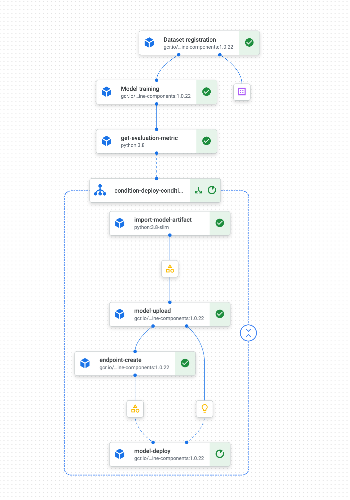

# Lab 3 - SPARK Hackfest - Machine Learning Operations with SPARK and Vertex AI

## CE043
![[/fragments/labmanuallogo]]

## Overview

Welcome to the **SPARK Hackfest!** <br><br>In this lab you will take on the role of a machine learning engineer. You will be challenged to take to production a SPARK MLib model that a colleage of yours, a data scientist has built in a notebook. Your input data will be the model/script generated on the previous Lab (Lab 2 - SPARK Hackfest - Data Science with SPARK). You will need to build a kubeflow pipeline that performs the full build-train-deploy cycle.
After the ML pipeline gets executed, you should have a model endpoint that is able to perform predictions on live data.


## Learning objectives

The lab includes studying and developing a number of common machine learning engineering tasks, including: <br>
* Development of a full build-train-deploy pipeline<br>


**_NOTE:_** The code provided in this lab is templatized, you will need to fill the code blocks marked with `INSERT_CODE_HERE` keyword.

For example:

* Deploy the model only if the output metric, `metric` is above a certain threshold, `threshold`

```python
 with Condition(
        _______INSERT_CODE_HERE_______,
        name="deploy_condition",
    ):
```
Code generated

```python
    with Condition(
        evaluateModelStep.outputs["metric"] >= threshold,
        name="deploy_condition",
    ):
```

## Setup and Requirements

![[/fragments/startqwiklab]]

![[/fragments/gcpconsole]]

![[/fragments/cloudshell]]

## Laboratory execution

### Introduction

It all starts when, on a quiet Wednesday morning, you receive the following email:


It seems a quite urgent task, so lets get to work! <br><br>  
First thing first:


After some "stackoverflow/medium engineering", we decide to go try out Vertex AI Pipelines, it is integrated with DataProc Serverless, our training engine.

 [Dataproc serverless]( https://cloud.google.com/dataproc-serverless/docs) lets you run Spark interactive workloads without requiring you to provision and manage your own cluster. You just need to connect to a Vertex AI Jupyter Notebook and start using a PySpark session without the need to create or manage a cluster.

 Using Dataproc serverless is very well suited for your task asignement:

 * Accelerated time-to-market: Spark developers and data scientists can use notebooks for their development, data exploration, and machine learning use cases without having to set up clusters in advance.
* No ops: The Data team does not need to create and manage clusters for individual users.
* Cost effective: Serverless Spark sessions auto-scale as needed vs fixed size clusters created for individual users. The sessions are also not under-utilized like larger long-running clusters used for interactive development.

## Lab deployed objects

In your Google Cloud project, you will find the following list of elements already pre-provisioned:

* A Service Account (`s8s-lab-sa@<PROJECT_ID>.iam.gserviceaccount.com`) + roles required for lab execution
* A VPC (`s8s-vpc-<PROJECT_ID>`) + subhet (spark-snet) + firewall rules
* GCS bucket for data (`gs://s8s_data_bucket-<PROJECT_ID>`)
* GCS bucket for code (`gs://s8s_code_bucket-<PROJECT_ID>`)
* GCS bucket for model serialization (`gs://s8s_model_bucket-<PROJECT_ID>`)
* Persistent History Server (dataproc) (`s8s-sphs-<PROJECT_ID>`)
* A BigQuery dataset (`customer_churn_ds`)
* A BigQuery table with the lab01-data-engineering output (`training_data_step_3`)
* A Container image for SPARK (`gcr.io/<PROJECT_ID>/customer_churn_image`)
* A Container image for serving SPARK MLib models with mleap (`gcr.io/<PROJECT_ID>/spark_ml_serving`)

### Pipeline development with Vertex AI Pipelines

1. From your Google Project, Open Cloud Shell
2. Execute :

```bash
$> export PROJECT_ID=`gcloud config list --format "value(core.project)" 2>/dev/null`
$> gcloud storage cp gs://s8s_code_bucket-${PROJECT_ID}/setup_pipeline_files.sh .
$> ./setup_pipeline_files.sh
```
This will download files for model building operativization

```
mlops
├── kfp_pipeline.py
├── launch_kfp_pipeline.sh
├── get_predictions.py
├── launch_get_predictions.sh
├── requirements.txt
└── schema.json
```

3. Complete the code blocks on the `kfp_pipeline.py` file
4. Once the file is ready, you need can execute the pipeline and wait for completion.
```bash
$> ./mlops/launch_kfp_pipeline.sh
```



5. Execute some random predictions
```bash
$> ./mlops/launch_get_predictions.sh
```
You should get predictions data back, for instance:
```bash
2022-10-18 16:03:57,705 - get_predictions.py - INFO - Prediction churn: 0.0
2022-10-18 16:03:57,705 - get_predictions.py - INFO - Instance: [string_value: "Female"
, number_value: 1.0
, string_value: "false"
, string_value: "true"
, string_value: "true"
, string_value: "true"
, string_value: "Fiber optic"
, string_value: "false"
, string_value: "false"
, string_value: "false"
, string_value: "false"
, string_value: "true"
, string_value: "true"
, string_value: "Two year"
, string_value: "true"
, string_value: "Bank transfer (automatic)"
, number_value: 35.05913415417532
, number_value: 4510.640628926135
, string_value: "true"
]
2022-10-18 16:03:57,706 - get_predictions.py - INFO - Prediction churn: 0.0
```

## Congratulations
This concludes the SPARK Hackfest - Machine Learning Operations with SPARK and Vertex AI


![[/fragments/endqwiklab]]

![[/fragments/copyright]]
